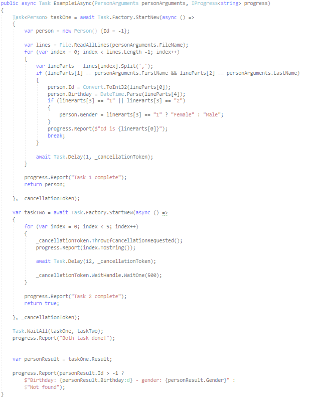

# Basic to intermediate Asynchronous programming
Real life examples working with asynchronous operations in **WinForms** and **C#** along when to use asynchronous, tips and when not to work with asynchronous coding.

Unlike most code samples found on the Internet, these code samples are devoid of the typical example of downloading files from the web, they have been covered to the point of exhaustion.

---

### Current samples
- Working with loading large files with exception handling and cancellation option
- Loading SQL-Server data with exception handing and cancellation option
- How to communicate between task and the form initializing a task
- Incorporate IProgress, delegates and events
- Waiting for more than one task to complete with cancellation option
- Keeping an application responsive when opening Excel
- Get current date time from the Internet
- Basic async operations (the place to start)
- Language extension method for uniform communication between threads to avoid cross thread operations

> Currently a work in progress.

---
TechNet article location TBA

---

> Visual Basic repository and article to follow.

